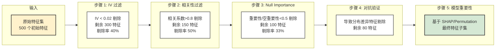

# 第四章 特征工程

## 4.1 特征工程在风控中的核心地位

在信贷风控领域，**特征工程的重要性往往高于模型选择**。一个精心设计的特征集+简单的逻辑回归，通常优于一个粗糙特征集+复杂的深度学习模型。原因在于：

1. 风险信号往往隐藏在业务逻辑中，需要领域知识显式构造
2. 模型可解释性要求限制了模型复杂度，特征质量更关键
3. 数据量通常有限，复杂模型容易过拟合

---

## 4.2 WOE编码与信息价值（IV）

WOE（Weight of Evidence，证据权重）是评分卡建模的核心编码方式。

### 4.2.1 WOE计算原理

$$WOE_i = \ln\left(\frac{P(X=i|Y=1)}{P(X=i|Y=0)}\right) = \ln\left(\frac{Bad_i/Bad_{total}}{Good_i/Good_{total}}\right)$$

$$IV = \sum_i (P(Y=1|X=i) - P(Y=0|X=i)) \times WOE_i$$

**WOE直觉理解**：
- WOE > 0：该分箱中坏客户比例高于总体
- WOE < 0：该分箱中坏客户比例低于总体
- WOE = 0：该分箱与总体无差异

**IV判断标准**：

| IV值 | 预测能力 |
|------|---------|
| < 0.02 | 无预测力，通常丢弃 |
| 0.02~0.1 | 弱预测力 |
| 0.1~0.3 | 中等预测力 |
| 0.3~0.5 | 强预测力 |
| > 0.5 | 预测力极强，需检查是否穿越 |

```python
import numpy as np
import pandas as pd

def calculate_woe_iv(df, feature, target, bins=10, min_bin_pct=0.05):
    """
    计算特征的WOE和IV
    支持数值型（分箱）和类别型
    """
    df = df[[feature, target]].copy()

    # 数值型自动分箱
    if df[feature].dtype in ['float64', 'int64']:
        df['bin'] = pd.qcut(df[feature], q=bins, duplicates='drop')
    else:
        df['bin'] = df[feature]

    # 计算每个分箱的好坏数量
    stats = df.groupby('bin', observed=True)[target].agg(
        bad='sum',
        total='count'
    ).reset_index()
    stats['good'] = stats['total'] - stats['bad']

    # 处理零值（防止log(0)）
    stats['bad'] = stats['bad'].replace(0, 0.5)
    stats['good'] = stats['good'].replace(0, 0.5)

    total_bad = stats['bad'].sum()
    total_good = stats['good'].sum()

    stats['bad_rate'] = stats['bad'] / stats['total']
    stats['pct_bad'] = stats['bad'] / total_bad
    stats['pct_good'] = stats['good'] / total_good
    stats['woe'] = np.log(stats['pct_bad'] / stats['pct_good'])
    stats['iv'] = (stats['pct_bad'] - stats['pct_good']) * stats['woe']

    iv_total = stats['iv'].sum()
    return stats, iv_total
```

### 4.2.2 最优分箱

好的分箱需满足：
- **单调性**：WOE随特征值单调递增或递减（业务逻辑一致）
- **显著性**：每个分箱的好坏样本量足够
- **覆盖率**：缺失值单独分箱

```python
from optbinning import OptimalBinning

def optimal_woe_binning(df, feature, target):
    """使用optbinning库进行最优分箱"""
    optb = OptimalBinning(
        name=feature,
        dtype='numerical',
        solver='cp',
        monotonic_trend='auto',   # 自动检测单调方向
        min_bin_size=0.05,        # 最小分箱比例5%
    )
    optb.fit(df[feature].values, df[target].values)

    # 获取分箱统计表
    binning_table = optb.binning_table.build()
    return optb, binning_table
```

---

## 4.3 数值型特征处理

### 4.3.1 统计聚合特征（时序数据）

行为数据往往是时序的，需要在不同时间窗口上做聚合：

```python
def build_time_window_features(df, id_col, date_col, value_col, windows=[1, 3, 6]):
    """
    构建多时间窗口聚合特征
    常用于：还款行为、消费行为、征信查询等
    """
    results = []
    observation_date = df[date_col].max()  # 假设单一观察点

    for window in windows:
        cutoff = observation_date - pd.DateOffset(months=window)
        window_df = df[df[date_col] >= cutoff]

        agg = window_df.groupby(id_col)[value_col].agg([
            ('sum', 'sum'),
            ('mean', 'mean'),
            ('max', 'max'),
            ('min', 'min'),
            ('count', 'count'),
            ('std', 'std'),
        ]).add_prefix(f'{value_col}_m{window}_')

        results.append(agg)

    return pd.concat(results, axis=1)
```

### 4.3.2 比率型特征

比率特征往往比绝对值更稳定、更有区分力：

```python
# 常见比率特征示例
features = {
    # 负债率
    'debt_to_income': df['total_debt'] / (df['monthly_income'] + 1e-6),

    # 已用额度比例（Credit Utilization Rate）
    'credit_utilization': df['used_credit'] / (df['total_credit_limit'] + 1e-6),

    # 还款覆盖率
    'payment_coverage': df['monthly_payment'] / (df['monthly_income'] + 1e-6),

    # 近期与历史逾期比（趋势信号）
    'recent_overdue_ratio': df['overdue_m3'] / (df['overdue_m12'] + 1e-6),
}
```

---

## 4.4 类别型特征处理

### 4.4.1 高基数类别特征处理

职业、城市等高基数特征不能直接One-Hot编码：

```python
def target_encode(df, col, target, n_splits=5, smoothing=10):
    """
    Target Encoding（目标编码）
    使用k-fold防止穿越，smoothing防止过拟合稀疏类别
    """
    from sklearn.model_selection import KFold

    df = df.copy()
    global_mean = df[target].mean()
    df[f'{col}_te'] = global_mean  # 初始化

    kf = KFold(n_splits=n_splits, shuffle=True, random_state=42)

    for train_idx, val_idx in kf.split(df):
        train_fold = df.iloc[train_idx]
        stats = train_fold.groupby(col)[target].agg(['mean', 'count'])
        # 平滑处理
        stats['smoothed'] = (
            (stats['mean'] * stats['count'] + global_mean * smoothing)
            / (stats['count'] + smoothing)
        )
        df.iloc[val_idx, df.columns.get_loc(f'{col}_te')] = (
            df.iloc[val_idx][col].map(stats['smoothed']).fillna(global_mean)
        )

    return df
```

### 4.4.2 职业/行业的风险分层

```python
# 基于业务经验的职业风险分层
OCCUPATION_RISK_MAP = {
    '公务员': 1,        # 低风险
    '教师': 1,
    '医生': 1,
    '工程师': 2,        # 中低风险
    '销售': 3,          # 中等风险
    '个体工商户': 3,
    '自由职业': 4,      # 高风险
    '无业': 5,          # 极高风险
}

df['occupation_risk'] = df['occupation'].map(OCCUPATION_RISK_MAP).fillna(3)
```

---

## 4.5 交叉特征

单一特征无法表达的风险模式，需要通过特征交叉来捕获：

```python
# 示例：收入与负债的交叉
df['income_debt_interaction'] = df['monthly_income'] * df['debt_burden_ratio']

# 示例：年龄与贷款期限的交叉
df['age_tenure_ratio'] = df['age'] / (df['loan_tenure_months'] + 1)

# 示例：设备风险与历史行为的交叉（欺诈信号叠加）
df['device_behavior_risk'] = df['device_risk_score'] * df['abnormal_behavior_flag']
```

**交叉特征的风险**：数量爆炸、过拟合、可解释性下降。需通过IV筛选或SHAP值控制。

---

## 4.6 文本与非结构化特征

### 4.6.1 借款用途文本特征

```python
from sklearn.feature_extraction.text import TfidfVectorizer
from sklearn.decomposition import TruncatedSVD

def extract_text_features(df, text_col, n_components=10):
    """从借款用途等文本字段提取特征"""
    tfidf = TfidfVectorizer(max_features=500, ngram_range=(1, 2))
    text_matrix = tfidf.fit_transform(df[text_col].fillna(''))

    # 降维
    svd = TruncatedSVD(n_components=n_components, random_state=42)
    text_features = svd.fit_transform(text_matrix)

    feat_df = pd.DataFrame(
        text_features,
        columns=[f'{text_col}_svd_{i}' for i in range(n_components)]
    )
    return feat_df
```

### 4.6.2 设备/行为序列特征

```python
# 申请行为序列：用户填写申请表的行为模式
# 例如：修改手机号次数、填写时长、滑动次数等

def extract_behavior_sequence_features(behavior_log):
    """
    从埋点日志中提取申请行为特征
    行为可能是欺诈识别的强信号
    """
    features = {
        'fill_duration_seconds': behavior_log['submit_time'] - behavior_log['start_time'],
        'phone_modify_count': behavior_log['phone_change_events'].apply(len),
        'id_modify_count': behavior_log['id_change_events'].apply(len),
        'copy_paste_count': behavior_log['paste_events'].apply(len),  # 粘贴次数（可能是填单工具）
        'page_back_count': behavior_log['back_events'].apply(len),
    }
    return pd.DataFrame(features)
```

---

## 4.7 特征选择

### 4.7.1 基于IV的初筛

```python
def iv_filter(iv_dict, threshold=0.02):
    """基于IV值筛选特征"""
    return {k: v for k, v in iv_dict.items() if v >= threshold}
```

### 4.7.2 相关性过滤

```python
def correlation_filter(df, features, threshold=0.8):
    """
    删除高度相关的特征（保留IV更高的那个）
    """
    corr_matrix = df[features].corr().abs()
    upper = corr_matrix.where(
        np.triu(np.ones(corr_matrix.shape), k=1).astype(bool)
    )

    to_drop = []
    for col in upper.columns:
        correlated = upper[col][upper[col] > threshold].index.tolist()
        to_drop.extend(correlated)

    return [f for f in features if f not in set(to_drop)]
```

### 4.7.3 基于模型的特征重要性

```python
import lightgbm as lgb
from sklearn.inspection import permutation_importance

def lgbm_feature_importance(X_train, y_train, X_val, y_val):
    """使用LightGBM评估特征重要性"""
    model = lgb.LGBMClassifier(
        n_estimators=200,
        learning_rate=0.05,
        num_leaves=31,
        class_weight='balanced',
        random_state=42
    )
    model.fit(X_train, y_train,
              eval_set=[(X_val, y_val)],
              callbacks=[lgb.early_stopping(20), lgb.log_evaluation(50)])

    importance_df = pd.DataFrame({
        'feature': X_train.columns,
        'importance_gain': model.feature_importances_,
    }).sort_values('importance_gain', ascending=False)

    return model, importance_df
```

---

## 4.9 高级特征选择技术（Kaggle 金牌方案）

### 特征选择流程总览



**图 4-1：特征选择五步流程图**

上图展示了 Kaggle 金牌方案中的系统特征选择方法：

1. **IV 过滤（Information Value Filtering）**：移除 IV 值低于 0.02 的无预测力特征，通常可减少 30%-50% 的特征数量
2. **相关性过滤（Correlation Filtering）**：对于高度相关的特征对（如相关系数>0.8），保留 IV 更高的那个，避免多重共线性
3. **Null Importance（空重要性筛选）**：通过打乱标签建立随机基准，只保留重要性超越噪声水平的特征
4. **对抗验证（Adversarial Validation）**：训练分类器区分训练集和测试集，剔除导致分布差异的特征，确保模型泛化能力
5. **模型重要性（Model-based Selection）**：基于 LightGBM/SHAP 值/置换重要性进行最终筛选

特征选择流程包含 5 个步骤：
1. **IV 过滤**：剔除无预测力的特征（IV < 0.02）
2. **相关性过滤**：剔除高度相关的冗余特征
3. **Null Importance**：只保留超越噪声基准的特征
4. **对抗验证**：剔除导致 train/test 分布差异的特征
5. **模型重要性**：最终确认特征的重要性

### 4.9.1 Null Importance 特征选择

**核心思想**：如果特征的重要性不比随机噪声高，则该特征无价值。

**方法起源**：
Null Importance 方法由 Kaggle Grandmaster CPMP 在 2018 年提出，并在多个风控竞赛中获得金牌。其核心洞察是：传统特征重要性无法回答"多小才算小"的问题，而通过打乱标签建立随机基准，可以提供统计显著性判断。

**统计解释**：
- 原假设 H0：特征与目标变量无关
- 通过打乱 y 生成的空重要性分布，相当于在原假设下的抽样分布
- 如果真实重要性显著高于空重要性（如 ratio > 2），则拒绝原假设

```python
import numpy as np
import pandas as pd
from lightgbm import LGBMClassifier

class NullImportanceSelector:
    """
    Null Importance 特征选择
    源自 Kaggle 风控竞赛金牌方案
    """
    def __init__(self, n_runs=10, threshold=0.5, random_state=42):
        self.n_runs = n_runs
        self.threshold = threshold  # 重要性/空重要性中位数阈值
        self.random_state = random_state
        self.feature_importance = None
        self.null_importance = None

    def fit(self, X, y, eval_set=None):
        """
        1. 计算真实重要性
        2. 打乱 y 多次，计算空重要性分布
        """
        rng = np.random.RandomState(self.random_state)

        # 真实重要性
        model = LGBMClassifier(n_estimators=100, random_state=self.random_state)
        model.fit(X, y, eval_set=eval_set, verbose=-1)
        self.feature_importance = pd.DataFrame({
            'feature': X.columns,
            'importance': model.feature_importances_
        })

        # 空重要性（打乱 y）
        null_imp = pd.DataFrame(index=X.columns)
        for i in range(self.n_runs):
            y_shuffled = y.sample(frac=1, random_state=rng.randint(0, 10000)).values
            model.fit(X, y_shuffled, verbose=-1)
            null_imp[f'run_{i}'] = model.feature_importances_

        self.null_importance = null_imp
        return self

    def get_selection(self):
        """
        选择标准：feature_importance / null_importance_median > threshold
        """
        null_median = self.null_importance.median(axis=1)
        ratio = self.feature_importance['importance'] / (null_median + 1e-6)

        selected = ratio[ratio > self.threshold].index.tolist()

        # 生成报告
        report = pd.DataFrame({
            'feature': self.feature_importance['feature'],
            'importance': self.feature_importance['importance'],
            'null_median': null_median.values,
            'ratio': ratio.values,
            'selected': ratio > self.threshold
        })

        return selected, report

# 使用示例
selector = NullImportanceSelector(n_runs=10, threshold=0.5)
selector.fit(X_train, y_train)
selected_features, report = selector.get_selection()
print(f"原始特征：{X_train.shape[1]}, 筛选后：{len(selected_features)}")
```

**为什么有效**：
- 传统重要性无法判断"多小才算小"
- Null Importance 建立了随机噪声的基准线
- 只有超越噪声的特征才值得保留

---

### 4.9.2 对抗验证（Adversarial Validation）

**核心思想**：检测训练集和测试集（或 OOT 样本）的分布差异，识别并剔除导致分布不一致的特征。

**方法原理**：
对抗验证的思想源于域适应（Domain Adaptation）领域。通过训练一个二分类器区分训练集和测试集：
- 如果分类器 AUC 接近 0.5，说明两套数据分布一致，无法区分
- 如果分类器 AUC 显著高于 0.5，说明两套数据存在系统性差异

**风控中的应用场景**：
1. **拒绝推断**：判断被拒绝客户与通过客户是否同分布
2. **OOT 验证**：判断时间窗口外样本（Out-of-Time）是否与训练集同分布
3. **域适应**：判断不同渠道/产品线/地区的客户是否可合并建模
4. **样本选择偏差检测**：判断训练样本是否代表了总体人群

**AUC 判断标准**：
- AUC < 0.55：分布一致，无需特殊处理
- 0.55 <= AUC < 0.60：存在轻微差异，需关注
- AUC >= 0.60：存在显著差异，必须处理（剔除导致差异的特征或重新采样）

```python
from sklearn.model_selection import StratifiedKFold
from sklearn.metrics import roc_auc_score

class AdversarialValidator:
    """
    对抗验证：检测 train/test 分布差异
    """
    def __init__(self, n_splits=5, lgbm_params=None, random_state=42):
        self.n_splits = n_splits
        self.lgbm_params = lgbm_params or {
            'n_estimators': 100,
            'learning_rate': 0.05,
            'num_leaves': 31,
            'verbose': -1
        }
        self.random_state = random_state
        self.feature_importance = None
        self.auc_ = None

    def fit(self, X_train, X_test):
        """
        训练对抗模型：区分 train vs test
        AUC 接近 0.5 说明分布一致
        AUC 显著高于 0.5 说明分布有差异
        """
        rng = np.random.RandomState(self.random_state)
        n_train, n_test = len(X_train), len(X_test)

        # 合并数据，构造标签
        X_combined = pd.concat([X_train, X_test], ignore_index=True)
        y_combined = np.array([0] * n_train + [1] * n_test)

        # 交叉验证
        kf = StratifiedKFold(n_splits=self.n_splits, shuffle=True, random_state=rng.randint(0, 10000))
        oof_pred = np.zeros(n_train + n_test)
        feature_imp = np.zeros(X_combined.shape[1])

        for train_idx, val_idx in kf.split(X_combined, y_combined):
            model = LGBMClassifier(**self.lgbm_params)
            model.fit(
                X_combined.iloc[train_idx], y_combined[train_idx],
                eval_set=[(X_combined.iloc[val_idx], y_combined[val_idx])],
                verbose=-1
            )
            oof_pred[val_idx] = model.predict_proba(X_combined.iloc[val_idx])[:, 1]
            feature_imp += model.feature_importances_ / self.n_splits

        self.auc_ = roc_auc_score(y_combined, oof_pred)
        self.feature_importance = pd.DataFrame({
            'feature': X_combined.columns,
            'importance': feature_imp
        }).sort_values('importance', ascending=False)

        return self

    def get_drop_features(self, threshold=0.1):
        """
        返回导致分布差异的特征（重要性最高的前 N 个）
        建议剔除这些特征或进行特殊处理
        """
        if self.feature_importance is None:
            return []

        # 相对重要性
        total_imp = self.feature_importance['importance'].sum()
        self.feature_importance['pct'] = self.feature_importance['importance'] / total_imp
        self.feature_importance['cumsum'] = self.feature_importance['pct'].cumsum()

        # 选择累积重要性前 threshold 的特征
        drop_feats = self.feature_importance[
            self.feature_importance['cumsum'] <= threshold
        ]['feature'].tolist()

        return drop_feats

# 使用示例
validator = AdversarialValidator()
validator.fit(X_train, X_oot)  # X_oot 是 OOT 验证集
print(f"对抗验证 AUC: {validator.auc_:.4f}")

if validator.auc_ > 0.55:
    print("⚠️ Train/Test 分布存在差异！")
    drop_feats = validator.get_drop_features(threshold=0.1)
    print(f"建议剔除的特征：{drop_feats}")
else:
    print("✓ Train/Test 分布一致，无需特殊处理")
```

**应用场景**：
- 拒绝推断（Reject Inference）：判断拒绝客户与通过客户是否同分布
- OOT 验证：判断时间窗口外样本是否可用
- 域适应：判断不同渠道/产品线的客户是否可合并建模

---

### 4.9.3 特征选择综合策略

Kaggle 金牌方案的特征选择流程：

```python
def comprehensive_feature_selection(X, y, X_oot=None):
    """
    综合特征选择流程
    1. IV 过滤（无预测力）
    2. 相关性过滤（冗余特征）
    3. Null Importance（超越噪声）
    4. 对抗验证（分布一致性）
    5. 模型重要性（最终确认）
    """
    print(f"初始特征数：{X.shape[1]}")

    # Step 1: IV 过滤
    iv_dict = {}
    for col in X.columns:
        _, iv = calculate_woe_iv(pd.DataFrame({col: X[col], 'target': y}), col, 'target')
        iv_dict[col] = iv
    iv_selected = [f for f, iv in iv_dict.items() if iv > 0.02]
    print(f"IV 筛选后：{len(iv_selected)}")

    # Step 2: 相关性过滤
    corr_selected = correlation_filter(X[iv_selected], iv_selected, threshold=0.85)
    print(f"相关性筛选后：{len(corr_selected)}")

    # Step 3: Null Importance
    null_selector = NullImportanceSelector(n_runs=10, threshold=0.5)
    null_selector.fit(X[corr_selected], y)
    null_selected, _ = null_selector.get_selection()
    print(f"Null Importance 筛选后：{len(null_selected)}")

    # Step 4: 对抗验证（如果有 OOT）
    if X_oot is not None:
        validator = AdversarialValidator()
        validator.fit(X[null_selected], X_oot[null_selected])
        if validator.auc_ > 0.55:
            drop_feats = validator.get_drop_features(threshold=0.1)
            null_selected = [f for f in null_selected if f not in drop_feats]
            print(f"对抗验证筛选后：{len(null_selected)}")

    return null_selected

# 使用
final_features = comprehensive_feature_selection(X_train, y_train, X_oot)
```

---

## 4.10 特征工程最佳实践

### 4.8.1 特征文档规范

每个进入模型的特征都应有完整文档：

```markdown
## 特征文档示例

**特征名**：`credit_query_cnt_m3`

**中文名**：近3个月征信查询次数

**计算逻辑**：统计观察点前90天内，人行征信报告中的机构查询记录数

**数据来源**：人行征信报告 → 查询记录表

**缺失含义**：无征信报告（即无贷款记录）→ 填充为0

**分布特征**：集中在0~5次，5次以上视为频繁查询

**风险逻辑**：查询次数越多 → 近期申贷行为频繁 → 资金紧张信号 → 坏率↑

**IV值**：0.15（中等预测力）

**单调性**：递增（查询次数越多，WOE越高）

**上线情况**：已上线，实时查询覆盖率约85%
```

### 4.8.2 特征稳定性检验

新特征上线前必须进行稳定性测试：

```python
def psi(expected, actual, bins=10):
    """
    计算PSI（Population Stability Index）
    expected: 训练集分布（基准）
    actual: 线上/测试集分布
    PSI < 0.1: 稳定
    0.1 <= PSI < 0.2: 轻微变化，需关注
    PSI >= 0.2: 显著漂移，需排查
    """
    breakpoints = np.percentile(expected, np.linspace(0, 100, bins + 1))
    breakpoints = np.unique(breakpoints)

    expected_pct = np.histogram(expected, bins=breakpoints)[0] / len(expected)
    actual_pct = np.histogram(actual, bins=breakpoints)[0] / len(actual)

    # 防止零值
    expected_pct = np.where(expected_pct == 0, 1e-6, expected_pct)
    actual_pct = np.where(actual_pct == 0, 1e-6, actual_pct)

    psi_value = np.sum((actual_pct - expected_pct) * np.log(actual_pct / expected_pct))
    return psi_value
```

---

> **本章小结**：特征工程是风控建模中最需要领域知识的环节。WOE编码提供了模型可解释性，时序聚合特征捕捉行为趋势，而特征文档和稳定性监控保障了特征的工程化质量。好的特征工程体系，是团队建模效率的核心资产。
