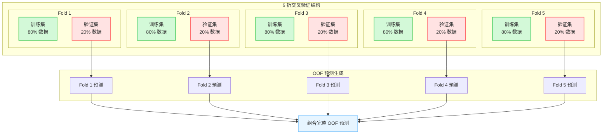
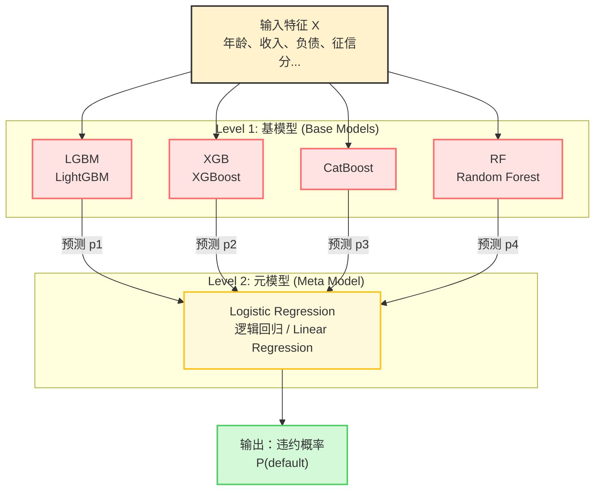
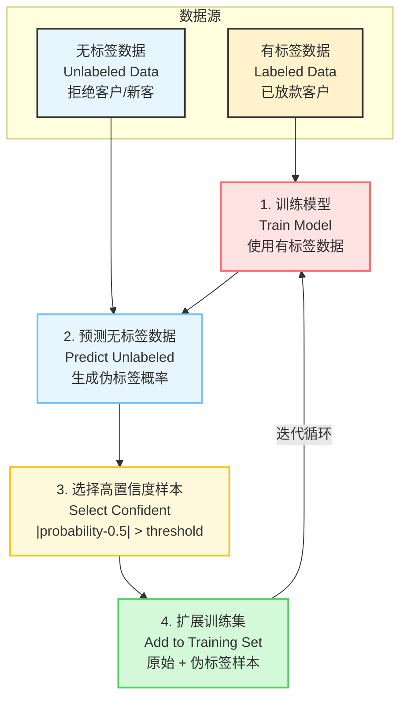

# 第六章 机器学习建模

## 6.1 机器学习在风控中的定位

ML 模型在风控中的角色已从"尝鲜"进化为"标配"，但需要明确其适用边界：

**适合 ML 的场景**：
- 特征维度高（>50 个），交互关系复杂
- 行为评分（存量客户，可解释性要求相对低）
- 反欺诈（需要捕捉非线性、交互关系）
- 辅助模型/拒绝辅助决策

**仍需评分卡的场景**：
- 监管要求强可解释性（需提供拒绝原因）
- 特征维度少且业务逻辑清晰
- 机构内部稳健性优先于性能

---

## 6.2 梯度提升树（GBDT 系列）

XGBoost/LightGBM/CatBoost 是信贷风控 ML 建模的主力模型。

### 6.2.1 LightGBM 调参实践

```python
import lightgbm as lgb
from sklearn.model_selection import StratifiedKFold
import optuna

def lgbm_objective(trial, X, y):
    """Optuna 超参数搜索目标函数"""
    params = {
        'objective': 'binary',
        'metric': 'auc',
        'verbosity': -1,
        'boosting_type': 'gbdt',

        # 树结构参数
        'num_leaves': trial.suggest_int('num_leaves', 20, 150),
        'max_depth': trial.suggest_int('max_depth', 3, 10),
        'min_child_samples': trial.suggest_int('min_child_samples', 20, 300),

        # 学习率
        'learning_rate': trial.suggest_float('learning_rate', 0.01, 0.1, log=True),
        'n_estimators': trial.suggest_int('n_estimators', 100, 1000),

        # 正则化
        'lambda_l1': trial.suggest_float('lambda_l1', 1e-8, 10.0, log=True),
        'lambda_l2': trial.suggest_float('lambda_l2', 1e-8, 10.0, log=True),

        # 采样（防过拟合）
        'feature_fraction': trial.suggest_float('feature_fraction', 0.4, 1.0),
        'bagging_fraction': trial.suggest_float('bagging_fraction', 0.4, 1.0),
        'bagging_freq': 1,

        # 类别不平衡
        'scale_pos_weight': (y == 0).sum() / (y == 1).sum(),
    }

    cv_results = lgb.cv(
        params, lgb.Dataset(X, label=y),
        nfold=5, stratified=True,
        num_boost_round=params['n_estimators'],
        callbacks=[lgb.early_stopping(20), lgb.log_evaluation(-1)],
    )

    return max(cv_results['valid auc-mean'])

def tune_lgbm(X, y, n_trials=50):
    study = optuna.create_study(direction='maximize')
    study.optimize(lambda trial: lgbm_objective(trial, X, y),
                   n_trials=n_trials, show_progress_bar=True)
    return study.best_params
```

### 6.2.2 风控建模的关键参数设置

```python
# 生产级 LightGBM 配置（风控场景）
lgbm_params = {
    'objective': 'binary',
    'metric': ['auc', 'binary_logloss'],

    # 防止过拟合（风控数据样本量通常不大）
    'num_leaves': 31,           # 不宜过大
    'min_child_samples': 100,   # 每个叶节点至少 100 个样本
    'feature_fraction': 0.8,    # 列采样
    'bagging_fraction': 0.8,    # 行采样
    'bagging_freq': 5,

    # 学习率要小，配合早停
    'learning_rate': 0.05,
    'n_estimators': 2000,       # 配合 early stopping 使用

    # 类别不平衡
    'scale_pos_weight': 20,     # 根据坏率调整，约为 good/bad 比例

    # 稳定性优先
    'max_depth': 6,             # 控制树深度
    'lambda_l1': 0.1,           # L1 正则
    'lambda_l2': 0.1,           # L2 正则
}

# 训练
model = lgb.LGBMClassifier(**lgbm_params)
model.fit(
    X_train, y_train,
    eval_set=[(X_val, y_val)],
    callbacks=[
        lgb.early_stopping(50),
        lgb.log_evaluation(100),
    ]
)
```

### 6.2.3 XGBoost vs LightGBM vs CatBoost 对比

**XGBoost**（eXtreme Gradient Boosting）：
- 优点：精度高、支持多种正则化、社区成熟
- 缺点：训练速度慢、内存占用大、不支持类别特征原生编码
- 适用场景：中小规模数据、追求极致精度

**LightGBM**（Light Gradient Boosting Machine）：
- 优点：训练速度快、内存占用小、支持类别特征原生编码、支持并行学习
- 缺点：在极小数据集上可能过拟合
- 适用场景：大规模数据、在线学习、风控生产环境

**CatBoost**（Categorical Boosting）：
- 优点：类别特征处理最佳、默认参数表现好、防止过拟合能力强
- 缺点：训练速度较慢、模型文件较大
- 适用场景：类别特征多、调参时间有限

**风控场景推荐**：LightGBM 通常是首选，因其速度、精度和可解释性的平衡最佳。

---

## 6.3 模型解释性工具

### 6.3.1 SHAP 值分析

SHAP（SHapley Additive exPlanations）是当前最主流的模型解释方法，基于博弈论中的 Shapley 值概念，由 Lundberg 和 Lee 在 2017 年提出。

**SHAP 的核心思想**：
- 将模型预测视为一个合作博弈，每个特征是一个玩家
- Shapley 值计算每个特征对预测结果的边际贡献
- SHAP 值满足加和性：所有特征的 SHAP 值之和 = 基值（base value）+ 实际预测 - 平均预测

**SHAP 值的优势**：
1. **理论保证**：唯一满足局部准确性、缺失性和一致性三大公理的解释方法
2. **全局 + 局部解释**：既可以解释单个样本，也可以汇总全局特征重要性
3. **模型无关**：适用于任何机器学习模型
4. **方向性**：SHAP 值的正负表示特征对预测的正/负向影响

```python
import shap

def shap_analysis(model, X_train, X_test, feature_names):
    """SHAP 值分析"""
    explainer = shap.TreeExplainer(model)
    shap_values = explainer.shap_values(X_test)

    # 如果是二分类，取坏客户的 SHAP 值
    if isinstance(shap_values, list):
        shap_values = shap_values[1]

    # 1. 全局特征重要性（beeswarm 图）
    shap.summary_plot(shap_values, X_test, feature_names=feature_names,
                       plot_type='dot', max_display=20)

    # 2. 单样本解释（瀑布图）
    def explain_single(idx):
        shap.waterfall_plot(
            shap.Explanation(
                values=shap_values[idx],
                base_values=explainer.expected_value,
                data=X_test.iloc[idx],
                feature_names=feature_names
            )
        )

    # 3. 特征依赖图
    def dependence_plot(feature):
        shap.dependence_plot(feature, shap_values, X_test,
                             feature_names=feature_names)

    return shap_values, explainer, explain_single

# SHAP 值用于生成拒绝理由码
def generate_reject_reasons(shap_values_single, feature_names, top_n=3):
    """生成前 N 个拒绝原因"""
    shap_df = pd.DataFrame({
        'feature': feature_names,
        'shap_value': shap_values_single
    })
    # 正 SHAP 值=增加违约概率=拒绝原因
    top_reasons = shap_df[shap_df['shap_value'] > 0].nlargest(top_n, 'shap_value')
    return top_reasons
```

### 6.3.2 理由码体系

将 SHAP 值映射为业务可理解的拒绝原因：

```python
REASON_CODE_MAP = {
    'credit_query_cnt_m3': ('R01', '近期征信查询次数过多'),
    'max_overdue_months':  ('R02', '历史最高逾期期数较高'),
    'debt_to_income':      ('R03', '当前负债收入比过高'),
    'age':                 ('R04', '年龄不在申请范围内'),
    'loan_tenure':         ('R05', '申请期限不符合要求'),
}

def get_top_reject_reasons(shap_values, feature_names, reason_map, top_n=3):
    reasons = []
    sorted_idx = np.argsort(shap_values)[::-1]  # 按 SHAP 值降序
    for idx in sorted_idx:
        feat = feature_names[idx]
        if feat in reason_map and shap_values[idx] > 0:
            code, desc = reason_map[feat]
            reasons.append({'code': code, 'description': desc,
                            'shap': shap_values[idx]})
        if len(reasons) == top_n:
            break
    return reasons
```

---

## 6.4 模型融合

### 6.4.1 Stacking

```python
from sklearn.model_selection import StratifiedKFold
from sklearn.linear_model import LogisticRegression

def stacking_blend(base_models, X_train, y_train, X_test, n_folds=5):
    """
    Stacking 融合：基模型预测结果作为元模型的输入
    """
    kf = StratifiedKFold(n_splits=n_folds, shuffle=True, random_state=42)
    train_meta = np.zeros((len(X_train), len(base_models)))
    test_meta = np.zeros((len(X_test), len(base_models)))

    for j, model in enumerate(base_models):
        test_preds = np.zeros((len(X_test), n_folds))
        for i, (train_idx, val_idx) in enumerate(kf.split(X_train, y_train)):
            model.fit(X_train.iloc[train_idx], y_train.iloc[train_idx])
            train_meta[val_idx, j] = model.predict_proba(
                X_train.iloc[val_idx])[:, 1]
            test_preds[:, i] = model.predict_proba(X_test)[:, 1]
        test_meta[:, j] = test_preds.mean(axis=1)

    # 元模型
    meta_model = LogisticRegression(C=1.0)
    meta_model.fit(train_meta, y_train)
    final_pred = meta_model.predict_proba(test_meta)[:, 1]

    return final_pred, meta_model

# 实践中更常用简单平均或加权平均
def weighted_blend(model_probs, weights=None):
    """加权平均融合"""
    probs = np.stack(model_probs, axis=1)
    if weights is None:
        weights = np.ones(len(model_probs)) / len(model_probs)
    return probs @ np.array(weights)
```

### 6.4.2 评分卡与 ML 模型融合

```python
# 常见方案：评分卡做准入门控，ML 做精细化排序
def two_stage_decision(scorecard_score, ml_score,
                        sc_cutoff=550, ml_cutoff=0.15):
    """
    两阶段决策：
    1. 评分卡低于阈值直接拒绝（可解释）
    2. 评分卡通过的用 ML 精细排序
    """
    decisions = []
    for sc, ml in zip(scorecard_score, ml_score):
        if sc < sc_cutoff:
            decisions.append({'result': 'REJECT', 'reason': 'scorecard_reject'})
        elif ml > ml_cutoff:
            decisions.append({'result': 'REJECT', 'reason': 'ml_high_risk'})
        else:
            decisions.append({'result': 'APPROVE', 'reason': None})
    return decisions
```

---

## 6.5 神经网络在风控中的应用

深度学习在结构化数据上的表现并不总优于 GBDT，但在以下场景有优势：

### 6.5.1 宽深模型（Wide & Deep）

```python
import torch
import torch.nn as nn

class WideDeep(nn.Module):
    """
    Wide & Deep 模型
    Wide 部分：线性模型（可解释），处理稀疏特征
    Deep 部分：MLP（非线性），处理稠密特征
    """
    def __init__(self, n_sparse_features, n_dense_features,
                 hidden_dims=[128, 64, 32]):
        super().__init__()

        # Wide 部分（线性）
        self.wide = nn.Linear(n_sparse_features, 1)

        # Deep 部分（MLP）
        layers = []
        in_dim = n_dense_features
        for out_dim in hidden_dims:
            layers.extend([
                nn.Linear(in_dim, out_dim),
                nn.BatchNorm1d(out_dim),
                nn.ReLU(),
                nn.Dropout(0.3),
            ])
            in_dim = out_dim
        self.deep = nn.Sequential(*layers)
        self.deep_output = nn.Linear(in_dim, 1)

    def forward(self, x_sparse, x_dense):
        wide_out = self.wide(x_sparse)
        deep_out = self.deep_output(self.deep(x_dense))
        output = torch.sigmoid(wide_out + deep_out)
        return output.squeeze()
```

### 6.5.2 序列模型（行为数据）

```python
class BehaviorLSTM(nn.Module):
    """
    LSTM 处理用户行为序列
    适用于：还款序列、APP 使用序列
    """
    def __init__(self, input_size, hidden_size=64, num_layers=2, dropout=0.2):
        super().__init__()
        self.lstm = nn.LSTM(
            input_size=input_size,
            hidden_size=hidden_size,
            num_layers=num_layers,
            batch_first=True,
            dropout=dropout
        )
        self.fc = nn.Linear(hidden_size, 1)

    def forward(self, x):
        # x: (batch_size, seq_len, input_size)
        _, (h_n, _) = self.lstm(x)
        out = self.fc(h_n[-1])  # 取最后一层的 hidden state
        return torch.sigmoid(out).squeeze()
```

---

## 6.6 建模中的时间序列问题

### 6.6.1 时间序列交叉验证

**不能**用随机交叉验证，必须用时序划分：

```python
from sklearn.model_selection import TimeSeriesSplit

def time_series_cv(X, y, dates, n_splits=5):
    """
    时间序列交叉验证
    训练集始终在验证集之前（模拟真实上线场景）
    """
    # 按日期排序
    sort_idx = dates.argsort()
    X_sorted = X.iloc[sort_idx]
    y_sorted = y.iloc[sort_idx]

    tscv = TimeSeriesSplit(n_splits=n_splits)
    scores = []

    for fold, (train_idx, val_idx) in enumerate(tscv.split(X_sorted)):
        X_tr, X_val = X_sorted.iloc[train_idx], X_sorted.iloc[val_idx]
        y_tr, y_val = y_sorted.iloc[train_idx], y_sorted.iloc[val_idx]

        model = lgb.LGBMClassifier(**lgbm_params)
        model.fit(X_tr, y_tr)

        from sklearn.metrics import roc_auc_score
        auc = roc_auc_score(y_val, model.predict_proba(X_val)[:, 1])
        scores.append(auc)
        print(f"Fold {fold+1}: AUC={auc:.4f}")

    print(f"\n平均 AUC: {np.mean(scores):.4f} ± {np.std(scores):.4f}")
    return scores
```

---

> **本章小结**：LightGBM 是风控 ML 建模的首选，SHAP 提供了向业务解释 ML 模型的语言，理由码体系使 ML 模型满足监管要求。神经网络在行为序列建模上有独特价值。时间序列交叉验证是评估风控模型的必要规范。

---

## 6.7 Kaggle 金牌方案核心技巧

### 6.7.1 OOF（Out-of-Fold）预测



**图 6-1：OOF 交叉验证流程图**

OOF（Out-of-Fold）预测是 Kaggle 竞赛和工业界风控建模中的核心技术：

**工作原理**：
1. 将训练集划分为 K 折（通常 K=5）
2. 每次用 K-1 折训练，剩余 1 折作为验证集
3. 对验证集的预测直接保留，形成 OOF 预测
4. 所有折的 OOF 预测组合起来，得到完整的训练集预测

**为什么有效**：
- **防止数据泄露**：每个样本的预测都是由未见过该样本的模型生成的
- **无偏泛化估计**：OOF 预测的 AUC 更接近真实测试集表现
- **Stacking 基础**：OOF 预测作为下一层元模型的输入特征
- **模型融合**：测试集预测通过多折平均得到，更加稳健

**核心思想**：用交叉验证的 out-of-fold 预测作为训练集的新特征，避免数据泄露。

```python
from sklearn.model_selection import StratifiedKFold
import lightgbm as lgb

def get_oof_predictions(X, y, X_test, model_params, n_splits=5, random_state=42):
    """
    生成 OOF 预测
    - oof_train: 训练集每个样本的 out-of-fold 预测
    - oof_test: 测试集的预测（多折平均）
    """
    kf = StratifiedKFold(n_splits=n_splits, shuffle=True, random_state=random_state)

    oof_train = np.zeros(len(X))
    oof_test = np.zeros(len(X_test))
    oof_models = []

    for fold, (train_idx, val_idx) in enumerate(kf.split(X, y)):
        print(f"Fold {fold + 1}/{n_splits}")

        X_train_fold = X.iloc[train_idx]
        y_train_fold = y.iloc[train_idx]
        X_val_fold = X.iloc[val_idx]
        y_val_fold = y.iloc[val_idx]

        model = lgb.LGBMClassifier(**model_params)
        model.fit(
            X_train_fold, y_train_fold,
            eval_set=[(X_val_fold, y_val_fold)],
            callbacks=[lgb.early_stopping(50), lgb.log_evaluation(200)]
        )

        # OOF 预测（验证集）
        oof_train[val_idx] = model.predict_proba(X_val_fold)[:, 1]

        # 测试集预测（累加后平均）
        oof_test += model.predict_proba(X_test)[:, 1] / n_splits

        oof_models.append(model)

    return oof_train, oof_test, oof_models

# 使用示例
params = {
    'n_estimators': 2000,
    'learning_rate': 0.05,
    'num_leaves': 31,
    'max_depth': 6,
    'feature_fraction': 0.8,
    'bagging_fraction': 0.8,
    'bagging_freq': 5,
    'scale_pos_weight': 20,
    'verbose': -1
}

oof_train, oof_test, models = get_oof_predictions(X_train, y_train, X_test, params)
print(f"OOF AUC: {roc_auc_score(y_train, oof_train):.4f}")
```

**为什么有效**：
- 避免直接使用训练集预测造成的过拟合
- 每折的模型都不同，集成的多样性更好
- 是 Stacking 集成的基础

---

### 6.7.2 Stacking 集成学习



**图 6-2：Stacking 集成学习架构图**

Stacking（堆叠）是一种多层集成学习方法，通过组合多个弱学习器来构建强学习器：

**架构说明**：
- **第一层（基模型）**：LGBM、XGB、CatBoost、RF 等不同模型并行处理输入特征。这些模型具有不同的归纳偏置，能够从不同角度捕捉数据模式
- **第二层（元模型）**：逻辑回归或线性回归将基模型的预测作为输入特征，学习如何最优地组合这些预测

**为什么有效**：
1. **多样性原理**：不同的基模型有不同的假设和偏好，集成可以减少方差
2. **误差抵消**：单个模型的错误预测可能被其他模型纠正
3. **特征空间转换**：基模型的预测作为元特征，将原始特征映射到更有判别力的空间

**Kaggle 实践技巧**：
- 基模型应选择差异较大的算法（树模型 + 线性模型 + 神经网络）
- 使用 OOF 预测作为元模型的训练数据，防止数据泄露
- 元模型通常选择简单模型（如逻辑回归），避免过拟合
- 可以进行多层 Stacking，但层数过多容易导致过拟合

---

### 6.7.3 Pseudo-Labeling（伪标签/拒绝推断）



**图 6-3：伪标签迭代流程图**

伪标签（Pseudo-Labeling）是一种半监督学习技术，在风控中主要用于拒绝推断（Reject Inference）：

**核心思想**：对无标签数据（如被拒绝的客户）用模型预测，将高置信度的预测作为伪标签加入训练集，迭代扩充训练数据。

**应用场景**：
1. **拒绝推断**：只有被批准的客户才有违约标签，拒绝客户的表现未知
2. **冷启动问题**：新产品/新渠道缺乏足够的历史标签数据
3. **样本不均衡**：坏样本数量远少于好样本

**算法流程**：
1. 使用有标签数据训练初始模型
2. 对无标签数据进行预测，得到违约概率
3. 选择高置信度样本（如预测概率<0.1 或>0.9）
4. 将伪标签样本加入训练集
5. 重新训练模型，重复迭代 2-3 轮

```python
def pseudo_labeling(X_train, y_train, X_unlabeled,
                    model_params, n_iterations=3, threshold=0.1):
    """伪标签迭代训练"""
    X_current = X_train.copy()
    y_current = y_train.copy()

    for iteration in range(n_iterations):
        print(f"Iteration {iteration + 1}/{n_iterations}")
        model = lgb.LGBMClassifier(**model_params)
        model.fit(X_current, y_current)

        probs = model.predict_proba(X_unlabeled)[:, 1]
        confident_mask = (probs < threshold) | (probs > 1 - threshold)
        n_selected = confident_mask.sum()

        if n_selected == 0:
            print("没有高置信度样本，停止迭代")
            break

        pseudo_labels = (probs > 0.5).astype(int)
        X_pseudo = X_unlabeled[confident_mask]
        y_pseudo = pseudo_labels[confident_mask]

        X_current = pd.concat([X_current, X_pseudo], ignore_index=True)
        y_current = pd.concat([y_current, pd.Series(y_pseudo)], ignore_index=True)
        print(f"  新增伪标签样本：{n_selected}, 当前训练集大小：{len(X_current)}")

    final_model = lgb.LGBMClassifier(**model_params)
    final_model.fit(X_current, y_current)
    return final_model, X_current, y_current
```

**注意事项**：
- 阈值要谨慎选择（0.1 表示预测概率<0.1 或>0.9 才接受）
- 迭代次数不宜过多（2-3 次为宜），否则误差会累积放大
- 需验证伪标签样本的质量（PSI 检查），确保与原始分布一致
- 在风控场景中，拒绝客户的伪标签可能存在样本选择偏差

---

### 6.7.4 Rank-based Blending（排序融合）

**核心思想**：不直接融合预测概率，而是融合样本的排序位置，更加稳健。

```python
def rank_blend(model_probs_list, weights=None):
    """基于排序的融合方法"""
    n_models = len(model_probs_list)
    n_samples = len(model_probs_list[0])

    if weights is None:
        weights = np.ones(n_models) / n_models

    ranks = np.zeros((n_samples, n_models))
    for i, probs in enumerate(model_probs_list):
        ranks[:, i] = pd.Series(probs).rank(method='average').values

    weighted_rank = np.average(ranks, axis=1, weights=weights)
    final_probs = weighted_rank / n_samples
    return final_probs
```

**为什么有效**：
- 概率校准（不同模型的概率尺度可能不同）
- 对异常值不敏感
- 在 Kaggle 竞赛中被广泛使用

---

### 6.7.5 类别不平衡的高级处理

```python
from imblearn.over_sampling import SMOTE
from imblearn.under_sampling import TomekLinks

def advanced_imbalance_handling(X_train, y_train, method='smote_tomek'):
    """高级类别不平衡处理"""
    if method == 'smote_tomek':
        smote = SMOTE(k_neighbors=5, random_state=42)
        tomek = TomekLinks()
        X_resampled, y_resampled = smote.fit_resample(X_train, y_train)
        X_cleaned, y_cleaned = tomek.fit_resample(X_resampled, y_resampled)
        return X_cleaned, y_cleaned
    return X_train, y_train
```

---

## 6.8 模型评估与监控

### 6.8.1 风控模型评估指标

```python
from sklearn.metrics import roc_auc_score, roc_curve, confusion_matrix
import numpy as np

def risk_model_metrics(y_true, y_pred_proba, threshold=0.5):
    """
    风控模型评估指标
    """
    y_pred = (y_pred_proba >= threshold).astype(int)

    # AUC
    auc = roc_auc_score(y_true, y_pred_proba)

    # KS 统计量
    fpr, tpr, thresholds = roc_curve(y_true, y_pred_proba)
    ks = max(tpr - fpr)
    ks_threshold = thresholds[np.argmax(tpr - fpr)]

    # 混淆矩阵指标
    tn, fp, fn, tp = confusion_matrix(y_true, y_pred).ravel()

    precision = tp / (tp + fp) if (tp + fp) > 0 else 0
    recall = tp / (tp + fn) if (tp + fn) > 0 else 0
    f1 = 2 * precision * recall / (precision + recall) if (precision + recall) > 0 else 0

    # 坏客户捕获率（Recall for bads）
    bad_capture_rate = recall

    # 好客户误杀率（False Positive Rate for goods）
    good_fp_rate = fp / (fp + tn) if (fp + tn) > 0 else 0

    return {
        'auc': auc,
        'ks': ks,
        'ks_threshold': ks_threshold,
        'precision': precision,
        'recall': recall,
        'f1': f1,
        'bad_capture_rate': bad_capture_rate,
        'good_fp_rate': good_fp_rate,
        'confusion_matrix': {'tp': tp, 'fp': fp, 'tn': tn, 'fn': fn}
    }
```

### 6.8.2 模型稳定性监控

```python
def calculate_psi(expected, actual, bins=10):
    """
    计算 PSI（Population Stability Index）
    用于监控模型预测分布的稳定性

    PSI < 0.1: 稳定
    0.1 <= PSI < 0.2: 轻微变化，需关注
    PSI >= 0.2: 显著漂移，需排查
    """
    breakpoints = np.percentile(expected, np.linspace(0, 100, bins + 1))
    breakpoints = np.unique(breakpoints)

    expected_pct = np.histogram(expected, bins=breakpoints)[0] / len(expected)
    actual_pct = np.histogram(actual, bins=breakpoints)[0] / len(actual)

    # 防止零值
    expected_pct = np.where(expected_pct == 0, 1e-6, expected_pct)
    actual_pct = np.where(actual_pct == 0, 1e-6, actual_pct)

    psi_value = np.sum((actual_pct - expected_pct) * np.log(actual_pct / expected_pct))
    return psi_value
```

---
