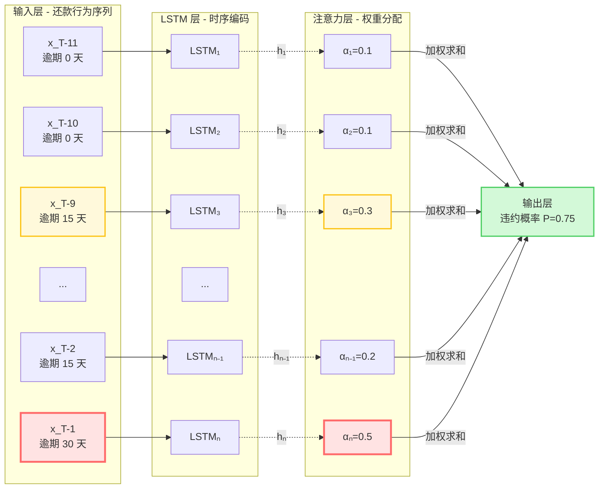
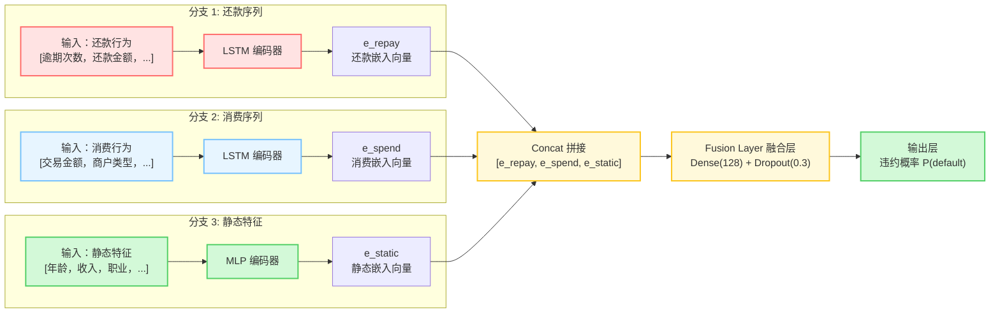

# 第十四章 序列模型在风控中的应用

## 14.1 序列数据在风控中的价值

### 14.1.1 风控中的序列数据类型

```
时序行为序列：
├── 还款行为序列（每月还款金额、逾期天数）
├── 消费行为序列（月度消费金额、消费频次）
├── 征信查询序列（查询时间、查询机构）
├── APP 使用序列（登录、浏览、点击）
└── 设备使用序列（登录时间、登录地点）

序列数据的特点：
- 时间依赖性：当前行为受历史行为影响
- 模式可变性：用户行为模式可能随时间变化
- 长度可变：不同用户的序列长度不同
```

### 14.1.2 为什么需要序列模型

**传统静态特征的局限**：
- 只能捕捉某个时间点的状态（snapshot），丢失了时间维度信息
- 无法捕捉行为趋势：例如用户从正常还款逐渐变为频繁逾期，这种恶化趋势是重要的风险信号
- 无法捕捉周期性模式：例如用户每月发工资后还款、月底消费高峰等规律
- 无法区分时序模式：两个用户都有 3 次逾期，但"早期逾期后期正常"与"早期正常近期逾期"风险截然不同

**序列模型的独特优势**：
1. **捕捉时间依赖关系**：当前行为受历史行为影响，序列模型可以建模这种动态依赖
2. **识别行为模式变化**：通过注意力机制或 RNN 隐藏状态，捕捉用户行为模式的演变
3. **预测未来行为趋势**：基于历史序列预测未来违约概率，而非仅基于当前状态
4. **处理变长序列**：不同用户的历史记录长度不同，序列模型可以自然处理

**序列模型在风控中的应用场景**：
- 还款行为预测：基于历史还款记录预测未来违约概率
- 消费行为建模：基于消费序列识别套现、欺诈等异常模式
- 动态额度管理：基于用户行为变化动态调整授信额度
- 早期预警系统：识别风险恶化趋势，提前介入干预

**深度学习序列模型对比**：
| 模型 | 优点 | 缺点 | 适用场景 |
|------|------|------|----------|
| LSTM | 捕捉长依赖、训练稳定 | 串行计算慢、长序列效果下降 | 中短期序列（<100 步） |
| GRU | 参数更少、训练更快 | 长依赖捕捉略弱于 LSTM | 资源受限场景 |
| Transformer | 并行计算、长依赖强 | 需要大量数据、计算密集 | 长序列、大数据场景 |

---

### 14.1.3 序列模型结构可视化

#### LSTM 序列处理流程图



**图 14-1：LSTM 序列处理流程图（带注意力机制）**

上图展示了 LSTM（长短期记忆网络）处理用户还款行为序列的完整流程：

**架构说明**：
- **输入层**：用户过去 12 期的还款记录（逾期天数序列），按期数从早期到近期排列
- **LSTM 层**：按时间顺序处理序列，每个时间步的隐藏状态 h_t 传递历史信息
  - LSTM 通过门控机制（遗忘门、输入门、输出门）控制信息流动
  - 能够捕捉长期依赖关系，避免传统 RNN 的梯度消失问题
- **注意力层**：自动学习各时间步的重要性权重（α₁~αₙ）
  - 权重通过可学习的神经网络计算，经 Softmax 归一化
  - 图中显示：近期逾期（T-1 期）权重最高（0.5）→ 最近违约信号更重要
  - 中期逾期（T-9 期）权重中等（0.3）→ 历史风险模式
  - 早期正常还款权重较低（0.1）→ 久远的信息参考价值低
- **输出层**：基于加权后的上下文向量，输出违约概率

**风险信号解读**：
- 该用户从早期正常还款（T-11、T-10 期逾期 0 天）到近期逾期恶化（T-1 期逾期 30 天）
- 模型通过注意力机制捕捉到这一**风险恶化趋势**
- 输出违约概率 0.75，建议拒绝

---

### 14.1.4 多模态序列融合架构



**图 14-2：多模态序列融合架构图**

上图展示了如何融合多种数据源进行风控建模：

**架构说明**：
1. **还款序列分支**：使用 LSTM 编码用户的还款行为序列，输出固定长度的嵌入向量 e_repay
2. **消费序列分支**：使用 LSTM 编码用户的消费行为序列，输出嵌入向量 e_spend
3. **静态特征分支**：使用 MLP（多层感知机）编码用户的基本属性（年龄、收入、职业等），输出嵌入向量 e_static
4. **融合层**：将三个模态的嵌入向量拼接，通过 Dense 层 + Dropout 进行特征融合和非线性变换
5. **输出层**：将融合后的特征映射为违约概率

**为什么有效**：
- **互补信息**：还款序列反映历史信用表现，消费序列反映当前消费能力和习惯，静态特征反映基本资质
- **多视角学习**：不同模态从不同角度描述用户风险，融合后信息更全面
- **端到端训练**：所有分支可以联合优化，自动学习各模态的相对重要性

## 14.2 循环神经网络（RNN）基础

**RNN 的发展脉络**：
- 1980s：标准 RNN 提出，理论上可以处理任意长度序列
- 1997：LSTM 提出，解决长依赖问题
- 2014：GRU 提出，简化 LSTM 结构
- 2017：Transformer 提出，自注意力机制颠覆序列建模
- 2020s：BERT、GPT 等大模型时代，但在风控等结构化数据场景，LSTM/GRU 仍有应用价值

### 14.2.1 RNN 的基本原理

标准 RNN 的更新公式：


**RNN 的问题**：
- 梯度消失/梯度爆炸：长序列训练时梯度会指数级衰减或爆炸
- 无法捕捉长距离依赖：理论上可以，实际上很难

**LSTM 的改进**：
- 引入门控机制：遗忘门、输入门、输出门
- 引入细胞状态（Cell State）：信息可以在时间步之间直接传递
- 梯度流动更加稳定：可以捕捉 100+ 时间步的依赖关系

### 14.2.1 LSTM（长短期记忆网络）

```python
import torch
import torch.nn as nn

class LSTMForRisk(nn.Module):
    """
    用于风控的 LSTM 模型
    输入：用户行为序列
    输出：违约概率
    """
    def __init__(self, input_size, hidden_size=64, num_layers=2, dropout=0.2):
        super().__init__()

        self.lstm = nn.LSTM(
            input_size=input_size,
            hidden_size=hidden_size,
            num_layers=num_layers,
            batch_first=True,
            dropout=dropout,
            bidirectional=False  # 单向 LSTM（只能用过去预测未来）
        )

        self.attention = AttentionLayer(hidden_size)
        self.fc = nn.Linear(hidden_size, 1)
        self.sigmoid = nn.Sigmoid()

    def forward(self, x, seq_len=None):
        """
        x: (batch_size, seq_len, input_size)
        seq_len: 每个样本的实际序列长度（用于 padding mask）
        """
        # LSTM 输出
        lstm_out, (h_n, c_n) = self.lstm(x)

        # 使用注意力机制聚合时间步
        # lstm_out: (batch_size, seq_len, hidden_size)
        context = self.attention(lstm_out, seq_len)

        # 输出层
        out = self.fc(context)
        out = self.sigmoid(out)

        return out.squeeze()


class AttentionLayer(nn.Module):
    """
    注意力层：给不同时间步分配不同权重
    """
    def __init__(self, hidden_size):
        super().__init__()
        self.attention = nn.Sequential(
            nn.Linear(hidden_size, hidden_size),
            nn.Tanh(),
            nn.Linear(hidden_size, 1)
        )

    def forward(self, lstm_out, seq_len=None):
        """
        lstm_out: (batch_size, seq_len, hidden_size)
        """
        # 计算注意力权重
        attn_scores = self.attention(lstm_out).squeeze(-1)  # (batch_size, seq_len)

        # Mask padding 部分
        if seq_len is not None:
            mask = torch.arange(lstm_out.size(1), device=lstm_out.device)[None, :] >= seq_len[:, None]
            attn_scores = attn_scores.masked_fill(mask, -1e9)

        # Softmax 归一化
        attn_weights = F.softmax(attn_scores, dim=1)

        # 加权求和
        context = (lstm_out * attn_weights.unsqueeze(-1)).sum(dim=1)

        return context
```

### 14.2.2 还款行为序列建模

```python
def prepare_repayment_sequence_data(repayment_log_df, label_df, seq_len=12):
    """
    准备还款行为序列数据

    repayment_log_df: 还款记录表
        - user_id: 用户 ID
        - period: 期数（1, 2, 3, ...）
        - repay_amount: 还款金额
        - overdue_days: 逾期天数
        - balance: 剩余本金

    label_df: 标签表
        - user_id: 用户 ID
        - isDefault: 是否违约
    """
    # 特征列
    feature_cols = ['repay_amount', 'overdue_days', 'balance']

    # 构建序列
    sequences = []
    labels = []
    user_ids = []

    for user_id in label_df['user_id'].unique():
        user_data = repayment_log_df[repayment_log_df['user_id'] == user_id]
        user_data = user_data.sort_values('period')

        # 提取特征序列
        features = user_data[feature_cols].values

        # 固定长度（padding 或 truncate）
        if len(features) < seq_len:
            # padding
            pad_width = seq_len - len(features)
            features = np.pad(features, ((pad_width, 0), (0, 0)), mode='constant')
        else:
            # truncate（保留最近 seq_len 期）
            features = features[-seq_len:]

        sequences.append(features)
        labels.append(label_df[label_df['user_id'] == user_id]['isDefault'].values[0])
        user_ids.append(user_id)

    # 转换为 Tensor
    X = torch.FloatTensor(np.array(sequences))  # (num_samples, seq_len, num_features)
    y = torch.FloatTensor(labels)

    return X, y, user_ids


# 训练示例
def train_lstm_model(X_train, y_train, X_val, y_val, epochs=50):
    """
    训练 LSTM 模型
    """
    model = LSTMForRisk(input_size=X_train.size(2), hidden_size=64)
    optimizer = torch.optim.Adam(model.parameters(), lr=0.001)
    criterion = nn.BCELoss()

    best_val_auc = 0
    for epoch in range(epochs):
        model.train()
        optimizer.zero_grad()

        # 前向传播
        outputs = model(X_train)
        loss = criterion(outputs, y_train)

        # 反向传播
        loss.backward()
        optimizer.step()

        # 验证
        model.eval()
        with torch.no_grad():
            val_outputs = model(X_val)
            val_auc = roc_auc_score(y_val.numpy(), val_outputs.numpy())

        if val_auc > best_val_auc:
            best_val_auc = val_auc
            torch.save(model.state_dict(), 'best_lstm_model.pth')

        if (epoch + 1) % 10 == 0:
            print(f"Epoch {epoch+1}/{epochs}, Loss: {loss.item():.4f}, Val AUC: {val_auc:.4f}")

    return model
```

---

## 14.3 Transformer 在风控中的应用

### 14.3.1 为什么用 Transformer

```
LSTM 的局限：
- 序列较长时，训练速度慢
- 难以捕捉长距离依赖

Transformer 的优势：
- 自注意力机制，并行计算
- 直接建模任意距离的依赖关系
- 在 NLP 领域已验证成功
```

### 14.3.2 简化版 Transformer 编码器

```python
import torch.nn.functional as F

class TransformerForRisk(nn.Module):
    """
    用于风控的 Transformer 编码器
    """
    def __init__(self, input_size, d_model=64, nhead=4, num_layers=2, dropout=0.1):
        super().__init__()

        # 输入嵌入
        self.input_embedding = nn.Linear(input_size, d_model)

        # Transformer Encoder
        encoder_layer = nn.TransformerEncoderLayer(
            d_model=d_model,
            nhead=nhead,
            dim_feedforward=d_model * 4,
            dropout=dropout,
            batch_first=True
        )
        self.transformer_encoder = nn.TransformerEncoder(encoder_layer, num_layers=num_layers)

        # 输出层
        self.classifier = nn.Linear(d_model, 1)

    def forward(self, x, mask=None):
        """
        x: (batch_size, seq_len, input_size)
        mask: 可选的 padding mask
        """
        # 嵌入
        x = self.input_embedding(x)  # (batch_size, seq_len, d_model)

        # Transformer 编码
        encoded = self.transformer_encoder(x, mask=mask)

        # 全局平均池化
        if mask is not None:
            # 只池化非 padding 部分
            mask_expanded = (~mask).unsqueeze(-1).float()
            pooled = (encoded * mask_expanded).sum(dim=1) / mask_expanded.sum(dim=1)
        else:
            pooled = encoded.mean(dim=1)

        # 输出
        out = torch.sigmoid(self.classifier(pooled))
        return out.squeeze()


# 使用示例
def train_transformer_model(X_train, y_train, X_val, y_val, epochs=50):
    """训练 Transformer 模型"""
    model = TransformerForRisk(input_size=X_train.size(2), d_model=64, nhead=4)
    optimizer = torch.optim.Adam(model.parameters(), lr=0.001, weight_decay=1e-5)
    criterion = nn.BCELoss()

    # 学习率调度器
    scheduler = torch.optim.lr_scheduler.ReduceLROnPlateau(
        optimizer, mode='max', factor=0.5, patience=5
    )

    best_val_auc = 0
    for epoch in range(epochs):
        model.train()
        optimizer.zero_grad()

        outputs = model(X_train)
        loss = criterion(outputs, y_train)
        loss.backward()

        # 梯度裁剪（防止梯度爆炸）
        torch.nn.utils.clip_grad_norm_(model.parameters(), max_norm=1.0)
        optimizer.step()

        # 验证
        model.eval()
        with torch.no_grad():
            val_outputs = model(X_val)
            val_auc = roc_auc_score(y_val.numpy(), val_outputs.numpy())

        scheduler.step(val_auc)

        if val_auc > best_val_auc:
            best_val_auc = val_auc
            torch.save(model.state_dict(), 'best_transformer_model.pth')

        if (epoch + 1) % 10 == 0:
            print(f"Epoch {epoch+1}, Loss: {loss.item():.4f}, Val AUC: {val_auc:.4f}")

    return model
```

---

## 14.4 多模态序列融合

### 14.4.1 多序列输入模型

```python
class MultiModalSequenceModel(nn.Module):
    """
    多模态序列融合模型
    同时处理多种行为序列：
    - 还款序列
    - 消费序列
    - APP 使用序列
    """
    def __init__(self, repayment_input_size, consumption_input_size, app_input_size,
                 d_model=64, nhead=4):
        super().__init__()

        # 各模态的编码器
        self.repayment_encoder = nn.LSTM(repayment_input_size, d_model, batch_first=True)
        self.consumption_encoder = nn.LSTM(consumption_input_size, d_model, batch_first=True)
        self.app_encoder = nn.LSTM(app_input_size, d_model, batch_first=True)

        # 融合层
        self.fusion = nn.Linear(d_model * 3, d_model)

        # 输出层
        self.classifier = nn.Linear(d_model, 1)

    def forward(self, repayment_seq, consumption_seq, app_seq):
        """
        repayment_seq: (batch_size, seq_len, repayment_input_size)
        consumption_seq: (batch_size, seq_len, consumption_input_size)
        app_seq: (batch_size, seq_len, app_input_size)
        """
        # 各模态编码
        _, (repay_h, _) = self.repayment_encoder(repayment_seq)
        _, (cons_h, _) = self.consumption_encoder(consumption_seq)
        _, (app_h, _) = self.app_encoder(app_seq)

        # 取最后时间步的 hidden state
        repay_emb = repay_h[-1]  # (batch_size, d_model)
        cons_emb = cons_h[-1]
        app_emb = app_h[-1]

        # 拼接融合
        combined = torch.cat([repay_emb, cons_emb, app_emb], dim=1)
        fused = F.relu(self.fusion(combined))

        # 输出
        out = torch.sigmoid(self.classifier(fused))
        return out.squeeze()
```

### 14.4.2 静态特征 + 序列特征融合

```python
class HybridModel(nn.Module):
    """
    混合模型：静态特征 + 序列特征
    """
    def __init__(self, static_input_size, sequence_input_size, d_model=64):
        super().__init__()

        # 序列编码器
        self.sequence_encoder = nn.LSTM(sequence_input_size, d_model, batch_first=True)

        # 静态特征 MLP
        self.static_mlp = nn.Sequential(
            nn.Linear(static_input_size, d_model),
            nn.ReLU(),
            nn.Dropout(0.3),
            nn.Linear(d_model, d_model),
        )

        # 融合层
        self.fusion = nn.Linear(d_model * 2, d_model)

        # 输出层
        self.classifier = nn.Linear(d_model, 1)

    def forward(self, static_features, sequence_features):
        """
        static_features: (batch_size, static_input_size)
        sequence_features: (batch_size, seq_len, sequence_input_size)
        """
        # 序列编码
        seq_out, (seq_h, _) = self.sequence_encoder(sequence_features)
        seq_emb = seq_h[-1]  # (batch_size, d_model)

        # 静态特征编码
        static_emb = self.static_mlp(static_features)  # (batch_size, d_model)

        # 融合
        combined = torch.cat([static_emb, seq_emb], dim=1)
        fused = F.relu(self.fusion(combined))

        # 输出
        out = torch.sigmoid(self.classifier(fused))
        return out.squeeze()


# 使用示例
def train_hybrid_model(static_train, seq_train, y_train,
                       static_val, seq_val, y_val, epochs=50):
    """训练混合模型"""
    model = HybridModel(
        static_input_size=static_train.size(1),
        sequence_input_size=seq_train.size(2),
        d_model=64
    )

    optimizer = torch.optim.Adam(model.parameters(), lr=0.001)
    criterion = nn.BCELoss()

    best_val_auc = 0
    for epoch in range(epochs):
        model.train()
        optimizer.zero_grad()

        outputs = model(static_train, seq_train)
        loss = criterion(outputs, y_train)
        loss.backward()
        optimizer.step()

        # 验证
        model.eval()
        with torch.no_grad():
            val_outputs = model(static_val, seq_val)
            val_auc = roc_auc_score(y_val.numpy(), val_outputs.numpy())

        if val_auc > best_val_auc:
            best_val_auc = val_auc
            torch.save(model.state_dict(), 'best_hybrid_model.pth')

        if (epoch + 1) % 10 == 0:
            print(f"Epoch {epoch+1}, Loss: {loss.item():.4f}, Val AUC: {val_auc:.4f}")

    return model
```

---

## 14.5 序列特征的解释性

### 14.5.1 注意力权重可视化

```python
import matplotlib.pyplot as plt
import seaborn as sns

def visualize_attention_weights(model, sequence_data, user_ids, feature_names):
    """
    可视化 LSTM 注意力权重
    理解哪些时间步对预测贡献最大
    """
    model.eval()
    attention_layer = model.attention

    with torch.no_grad():
        lstm_out, _ = model.lstm(sequence_data)
        attn_scores = attention_layer.attention(lstm_out).squeeze(-1)
        attn_weights = F.softmax(attn_scores, dim=1)

    # 绘制热力图
    plt.figure(figsize=(12, 8))
    sns.heatmap(
        attn_weights.numpy(),
        xticklabels=[f'Period {i+1}' for i in range(sequence_data.size(1))],
        yticklabels=user_ids,
        cmap='YlOrRd'
    )
    plt.title('Attention Weights Across Time Steps')
    plt.xlabel('Time Period')
    plt.ylabel('User')
    plt.tight_layout()
    plt.show()

    return attn_weights
```

### 14.5.2 时间步重要性分析

```python
def analyze_time_step_importance(model, sequence_data, y_true):
    """
    分析各时间步的重要性
    通过扰动（perturbation）方法
    """
    model.eval()
    baseline_auc = roc_auc_score(y_true, model(sequence_data).numpy())

    importance_scores = []

    for t in range(sequence_data.size(1)):
        # 复制数据
        perturbed = sequence_data.clone()

        # 将第 t 个时间步置零
        perturbed[:, t, :] = 0

        # 计算 AUC 下降
        perturbed_auc = roc_auc_score(y_true, model(perturbed).numpy())
        importance = baseline_auc - perturbed_auc
        importance_scores.append(importance)

    # 可视化
    plt.figure(figsize=(10, 5))
    plt.bar(range(len(importance_scores)), importance_scores)
    plt.xlabel('Time Step')
    plt.ylabel('Importance (AUC Drop)')
    plt.title('Time Step Importance Analysis')
    plt.xticks(range(len(importance_scores)), [f'T-{i}' for i in range(len(importance_scores)-1, -1, -1)])
    plt.tight_layout()
    plt.show()

    return importance_scores
```

---

## 14.6 序列模型的实战技巧

### 14.6.1 处理变长序列

```python
from torch.nn.utils.rnn import pack_padded_sequence, pad_packed_sequence

def train_with_packing(X_sequences, y, seq_lengths):
    """
    使用 pack_padded_sequence 处理变长序列
    可以加速训练并提高效果
    """
    # 按序列长度降序排序
    sorted_idx = seq_lengths.argsort()[::-1]
    X_sorted = X_sequences[sorted_idx]
    y_sorted = y[sorted_idx]
    seq_lengths_sorted = seq_lengths[sorted_idx]

    # Pack 序列
    packed = pack_padded_sequence(
        X_sorted,
        seq_lengths_sorted,
        batch_first=True,
        enforce_sorted=True
    )

    # 模型前向传播（需要支持 pack 的模型）
    # lstm_out, (h_n, c_n) = lstm(packed)

    return packed
```

### 14.6.2 序列数据增强

```python
def sequence_augmentation(X, y, augmentation_method='jitter'):
    """
    序列数据增强方法
    """
    augmented_X = []
    augmented_y = []

    if augmentation_method == 'jitter':
        # 添加高斯噪声
        noise = torch.randn_like(X) * 0.1
        augmented_X = X + noise
        augmented_y = y

    elif augmentation_method == 'time_warp':
        # 时间扭曲（随机拉伸/压缩序列）
        for i in range(len(X)):
            seq = X[i]
            # 随机选择 warp 因子
            warp_factor = np.random.uniform(0.9, 1.1)
            new_len = int(len(seq) * warp_factor)

            if new_len < len(seq):
                # 截断
                start = np.random.randint(0, len(seq) - new_len)
                warped = seq[start:start+new_len]
            else:
                # 插值
                from scipy.interpolate import interp1d
                warped = np.zeros((new_len, seq.shape[1]))
                for j in range(seq.shape[1]):
                    f = interp1d(np.arange(len(seq)), seq[:, j], kind='linear')
                    warped[:, j] = f(np.linspace(0, len(seq)-1, new_len))

            augmented_X.append(warped)
        augmented_X = torch.FloatTensor(np.array(augmented_X))
        augmented_y = y

    return augmented_X, augmented_y
```

---

## 14.7 序列模型在风控中的挑战

### 14.7.1 数据质量问题

```markdown
⚠️ 序列数据常见问题：

1. 缺失值处理
   - 用户可能没有完整的历史记录
   - 需要区分"无数据"和"零值"

2. 异常值处理
   - 某些时间步可能存在异常值
   - 需要平滑或截断处理

3. 时间对齐
   - 不同用户的时间起点可能不同
   - 需要对齐到统一的时间参考点
```

### 14.7.2 模型部署考虑

```python
class SequenceModelForDeployment(nn.Module):
    """
    用于部署的序列模型
    优化推理速度
    """
    def __init__(self, ...):
        super().__init__()
        # ... 模型定义

    def predict_single(self, sequence):
        """
        单样本推理（用于实时预测）
        """
        self.eval()
        with torch.no_grad():
            # 添加 batch 维度
            if sequence.dim() == 2:
                sequence = sequence.unsqueeze(0)
            output = self(sequence)
            return output.item()

    def export_to_onnx(self, output_path):
        """
        导出为 ONNX 格式（用于生产部署）
        """
        dummy_input = torch.randn(1, 12, self.input_size)  # batch=1, seq_len=12
        torch.onnx.export(
            self,
            dummy_input,
            output_path,
            input_names=['sequence'],
            output_names=['probability'],
            dynamic_axes={'sequence': {0: 'batch_size', 1: 'seq_len'}}
        )
```

---

> **本章小结**：序列模型能够捕捉用户行为的时间依赖关系，适合还款行为预测、风险趋势识别等场景。LSTM 和 Transformer 是主流选择，注意力机制提供了模型解释性。实际应用中需注意数据质量、变长序列处理和模型部署优化。
